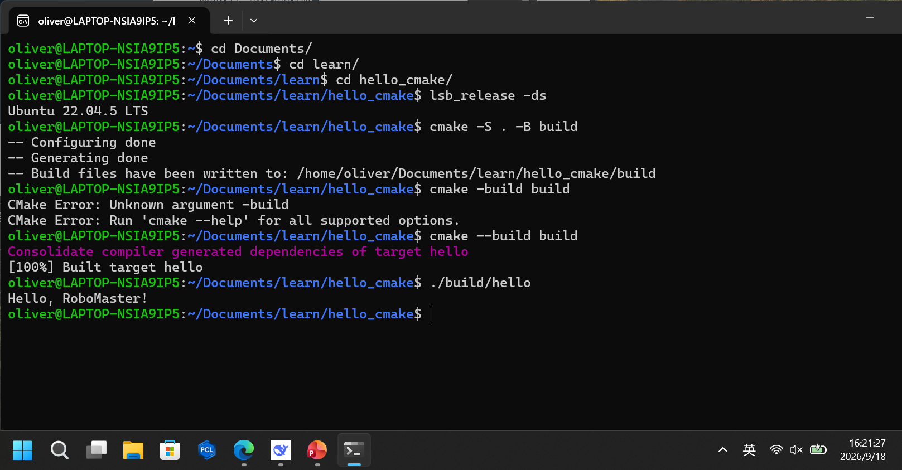

# Hello CMake

## 环境
- Ubuntu 22.04 LTS
- CMake 3.22+
- GCC 11+

## 构建与运行
```bash
cmake -S . -B build
cmake --build build
./build/hello
```
## 期望结果
```bash
Hello, RoboMaster!
```


李浩然 2266113713 20260918